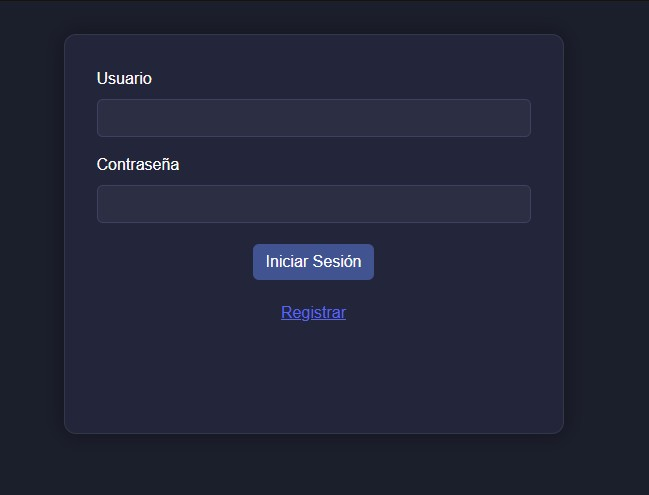
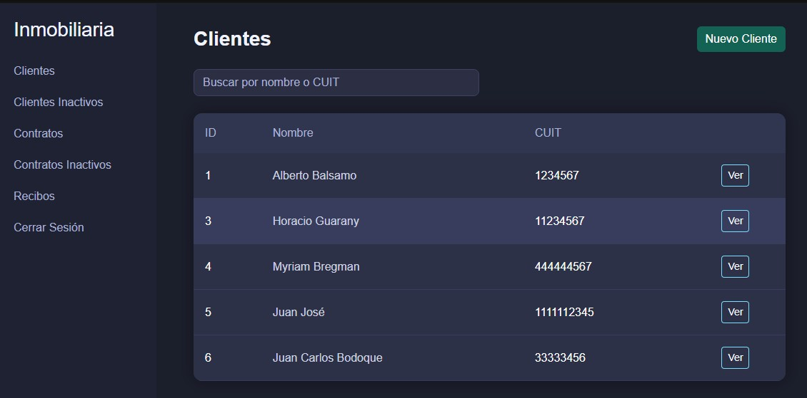
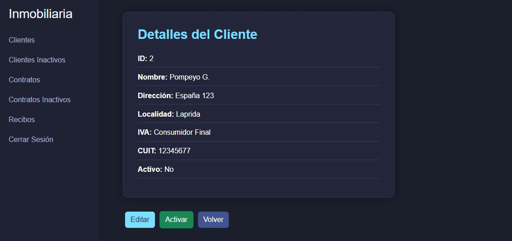
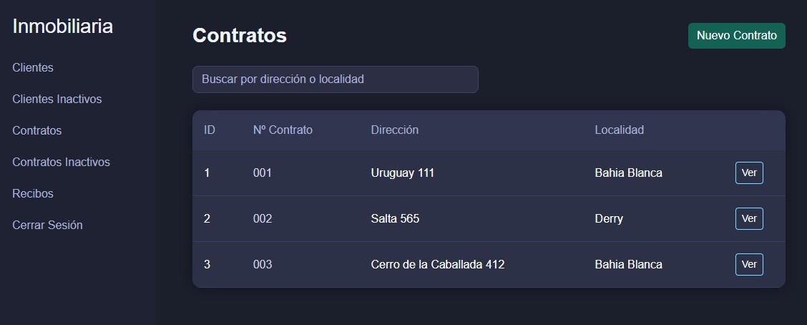
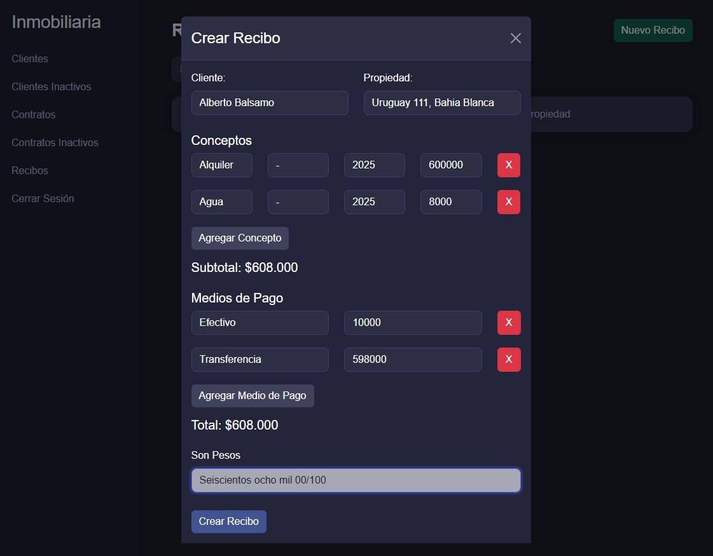

# Frontend de Sistema de generación de recibos para inmobiliarias

Aplicación web desarrollada en **React** para la gestión de **clientes, contratos y recibos** de una inmobiliaria.  
Permite realizar el **login de administrador**, la **creación y visualización de recibos PDF**, y la administración de datos desde una interfaz moderna y responsiva.

Proyecto final para **Prácticas Supervisadas (PS)** – UTN FRBB.

**Autor:** Pom94 (Pamela Dominguez Fernandez)

---

## Tabla de Contenidos
- [Descripción del Proyecto](#descripción-del-proyecto)
- [Tecnologías Utilizadas](#tecnologías-utilizadas)
- [Pantallas Principales](#pantallas-principales)
- [Despliegue](#despliegue)
- [Ejecución Local](#ejecución-local)
- [Repositorios](#repositorios)

---

### Descripción del Proyecto

Interfaz web que debe consumir datos de una [API REST](https://github.com/Pom94/inmobiliaria_recibos_backend.git) previamente desarrollada para:

- **Iniciar sesión** de administrador (autenticación con token JWT).
- **Registrar nuevo administrador** (solo si no existe).
- **Gestionar clientes, contratos y recibos**.
- **Emitir y descargar recibos PDF** con conceptos y medios de pago.
- Visualización clara de datos mediante **tablas estilizadas** y **alertas interactivas**.
- Diseño moderno y con tonos oscuros/azules para una experiencia profesional y elegante.

> Proyecto pensado para **inmobiliarias pequeñas** que necesitan generar y archivar recibos digitales.

---

### Tecnologías Utilizadas

| Tecnología | Uso |
|-------------|-----|
| **React 19** | Framework principal de frontend |
| **Create React App** | Entorno de desarrollo y build |
| **React Router DOM 7** | Navegación entre pantallas |
| **Axios** | Llamadas HTTP a la API REST |
| **Bootstrap 5.3** | Estilos base |
| **React-Bootstrap 2.10** | Componentes de UI |
| **CSS personalizado** | Estilo visual adaptado al diseño del sistema |
| **LocalStorage** | Almacenamiento del token JWT |

---

### Pantallas Principales

| Pantalla | Descripción |
|-----------|--------------|
| **Iniciar Sesión** | Permite autenticarse como administrador mediante token JWT |
| **Registrar** | Crea el primer administrador si no existe |
| **Clientes** | ABM (alta, baja, modificación) de clientes |
| **Contratos** | ABM (alta, baja, modificación) de contratos |
| **Recibos** | Creación, listado y visualización de recibos PDF |
| **Detalle de Recibo** | Vista completa del recibo generado |

> Todas las operaciones protegidas requieren estar logueado con un **token JWT** válido.

---

### Despliegue

El frontend se conecta con la API desplegada en Render:

- **Backend:** [https://inmobiliaria-recibos-backend.onrender.com](https://inmobiliaria-recibos-backend.onrender.com)
- **Frontend:** [https://inmobiliaria-recibos-frontend.onrender.com](https://inmobiliaria-recibos-frontend.onrender.com)

> Para registrarse, el programa aceptara como usuario "admin", ya que el programa está pensado (por ahora) para un único cliente administrador


### Ejecución local

#### Requisitos
- Node.js 18 o superior  
- npm (viene incluido con Node)  
- Git  

#### Pasos

```bash
git clone https://github.com/Pom94/inmobiliaria_recibos_frontend.git
cd inmobiliaria_recibos_frontend
npm start
```

> La aplicación se ejecutará en ``http://localhost:3000``

> Asegúrate de que el backend esté corriendo en ``http://localhost:8080``. Y deberá cambiar la configuración **\src\components\IniciarSesion.js** y **\src\components\Registrar.js** en la parte de **respuesta**; y en **\src\services\api.js** donde dice **URL_BASE_API** ingresar **'http://localhost:8080'** o donde esté corriendo la API a ser consumida

> Para registrarse, el programa aceptara como usuario "admin", ya que el programa está pensado (por ahora) para un único cliente administrador

### 📸 Capturas de Pantalla

A continuación se muestran algunas vistas principales de la aplicación:

#### 🔐 Pantalla de Inicio de Sesión


#### 👥 Gestión de Clientes


#### 👥 Detalle de Cliente


#### 🏠 Gestión de Propiedades


#### 💰 Generación de Recibos


### Repositorios

- **Backend:** [github.com/Pom94/inmobiliaria_recibos_backend](https://github.com/Pom94/inmobiliaria_recibos_backend)
- **Frontend:** [github.com/Pom94/inmobiliaria_recibos_frontend](https://github.com/Pom94/inmobiliaria_recibos_frontend)
